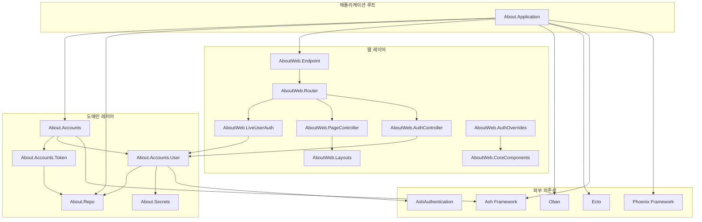
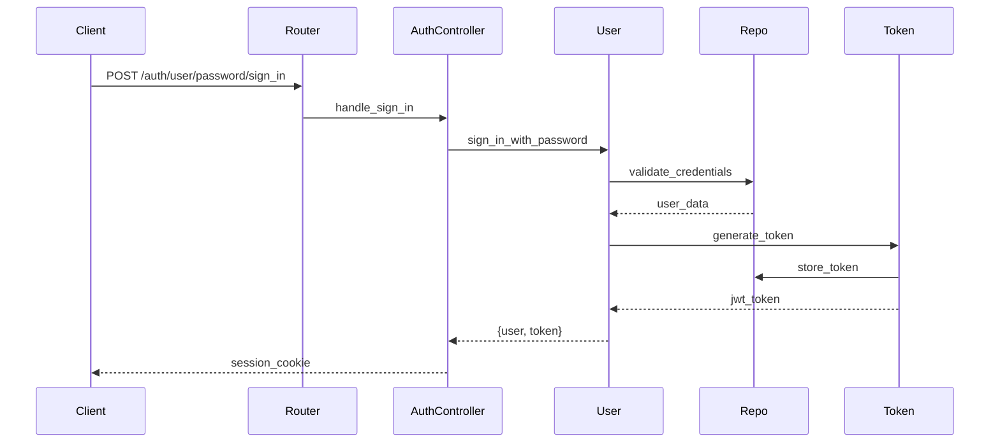
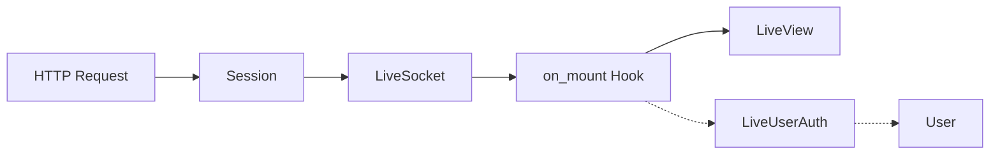
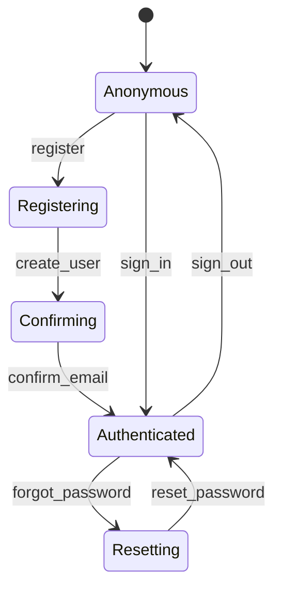
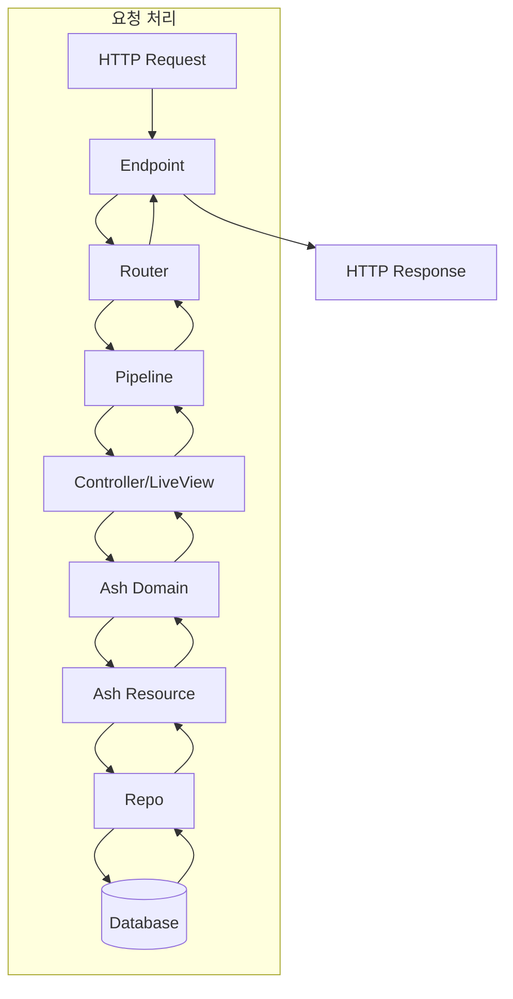

# 모듈 관계 및 의존성 문서

## 📊 모듈 의존성 그래프



## 🔗 모듈 상세 관계

### 1. About.Application (진입점)

**의존성**:
- `Phoenix.PubSub` - 내부 통신
- `About.Repo` - 데이터베이스 연결
- `AboutWeb.Endpoint` - HTTP 서버
- `Oban` - 백그라운드 작업
- `AshAuthentication.Supervisor` - 인증 시스템

**시작 순서**:
1. AboutWeb.Telemetry (메트릭 수집)
2. About.Repo (데이터베이스)
3. Ecto.Migrator (마이그레이션)
4. Oban (작업 큐)
5. DNSCluster (클러스터링)
6. Phoenix.PubSub (pub/sub)
7. AboutWeb.Endpoint (웹 서버)
8. AshAuthentication.Supervisor (인증)

### 2. About.Accounts (도메인 경계)

```elixir
# 리소스 등록
resources do
  resource About.Accounts.Token
  resource About.Accounts.User
end
```

**역할**:
- Ash 도메인 경계 정의
- 리소스 그룹화 및 관리
- 정책 적용 범위 설정
- Admin 인터페이스 제공

**의존 관계**:
```
About.Accounts
    ├── About.Accounts.User
    │   ├── AshAuthentication (인증 전략)
    │   ├── About.Repo (데이터 저장)
    │   └── About.Secrets (토큰 서명)
    └── About.Accounts.Token
        └── About.Repo (데이터 저장)
```

### 3. About.Accounts.User (핵심 리소스)

**주요 모듈 관계**:

| 모듈 | 관계 타입 | 설명 |
|------|----------|------|
| AshAuthentication | Extension | 인증 기능 제공 |
| AshSqlite | Data Layer | 데이터베이스 연동 |
| About.Repo | Repository | SQL 쿼리 실행 |
| About.Secrets | Secret Provider | JWT 토큰 서명 |
| About.Accounts.Token | Association | 토큰 관리 |

**액션 흐름**:


### 4. AboutWeb.Router (라우팅 허브)

**의존성 주입**:
```elixir
use AshAuthentication.Phoenix.Router  # 인증 라우트
import Oban.Web.Router               # Oban 대시보드
import AshAdmin.Router               # Admin 인터페이스
```

**파이프라인 체인**:
```
:browser pipeline
    ├── :accepts ["html"]
    ├── :fetch_session
    ├── :fetch_live_flash
    ├── :protect_from_forgery
    └── :load_from_session (AshAuth)

:api pipeline
    ├── :accepts ["json"]
    ├── :load_from_bearer (AshAuth)
    └── :set_actor :user
```

### 5. LiveView 인증 체인



**Hook 종류**:
- `:live_user_required` → 인증 필수
- `:live_user_optional` → 인증 선택적
- `:live_no_user` → 비인증만

### 6. 컴포넌트 계층 구조

```
AboutWeb.Layouts
    ├── :root (HTML 루트)
    └── :app (애플리케이션 레이아웃)
        └── AboutWeb.CoreComponents
            ├── <.button>
            ├── <.input>
            ├── <.icon>
            ├── <.modal>
            └── <.flash>
```

## 🔄 데이터 플로우

### 인증 플로우



### 요청 처리 플로우



## 📦 패키지 의존성

### 핵심 의존성 트리

```
about
├── phoenix (1.8.1)
│   ├── phoenix_pubsub
│   ├── phoenix_html
│   └── phoenix_live_view (1.1.0)
│       └── phoenix_live_dashboard
├── ash (3.0)
│   ├── ash_phoenix (2.0)
│   ├── ash_sqlite (0.2)
│   │   └── ecto_sqlite3
│   └── ash_authentication (4.0)
│       └── ash_authentication_phoenix (2.0)
├── oban (2.0)
│   ├── oban_web (2.0)
│   └── ash_oban (0.4)
├── ecto_sql (3.13)
│   └── postgrex
└── cloak (1.0)
    └── ash_cloak (0.1)
```

### 개발 의존성

```
dev/test
├── igniter (0.6)
├── sourceror (1.8)
├── tidewave (0.4)
├── live_debugger (0.4)
└── lazy_html (test only)
```

## 🎯 모듈 책임

### 도메인 레이어 책임

| 모듈 | 책임 |
|------|------|
| About.Accounts | 사용자 도메인 경계, 리소스 관리 |
| About.Accounts.User | 사용자 데이터, 인증 로직 |
| About.Accounts.Token | JWT 토큰 관리, 폐기 |
| About.Repo | 데이터베이스 연결, 쿼리 실행 |
| About.Secrets | 암호화 키, 토큰 서명 |

### 웹 레이어 책임

| 모듈 | 책임 |
|------|------|
| AboutWeb.Router | URL 라우팅, 파이프라인 정의 |
| AboutWeb.Endpoint | HTTP 서버 설정, 소켓 관리 |
| AboutWeb.AuthController | 인증 요청 처리 |
| AboutWeb.LiveUserAuth | LiveView 인증 상태 관리 |
| AboutWeb.CoreComponents | 재사용 가능한 UI 컴포넌트 |
| AboutWeb.Layouts | 페이지 레이아웃 |

## 🔐 보안 경계

### 인증 경계
```
Public Zone (비인증)
    ├── 홈페이지
    ├── 로그인/등록
    └── 비밀번호 재설정

Protected Zone (인증 필수)
    ├── 사용자 프로필
    ├── 대시보드
    └── 설정

Admin Zone (관리자)
    ├── Ash Admin
    ├── Oban Dashboard
    └── LiveDashboard
```

### 데이터 접근 제어
```elixir
# Ash Policy 예시
policies do
  # AshAuthentication 상호작용 허용
  bypass AshAuthentication.Checks.AshAuthenticationInteraction do
    authorize_if always()
  end
  
  # 기본 거부
  policy always() do
    forbid_if always()
  end
end
```

## 🚀 성능 고려사항

### 모듈 로딩 최적화
- Lazy loading으로 초기 로드 시간 단축
- 컴파일 시 프로토콜 통합 (`consolidate_protocols`)
- 개발 환경에서만 코드 리로딩

### 데이터베이스 연결
- Connection pooling (Ecto)
- SQLite WAL 모드 활성화
- 인덱스 최적화

### 백그라운드 작업
- Oban 큐별 동시성 제한
- 작업 우선순위 관리
- 실패 재시도 전략

---

*이 문서는 모듈 간 관계와 의존성을 명확히 하여 개발자가 시스템을 이해하고 유지보수할 수 있도록 돕습니다.*