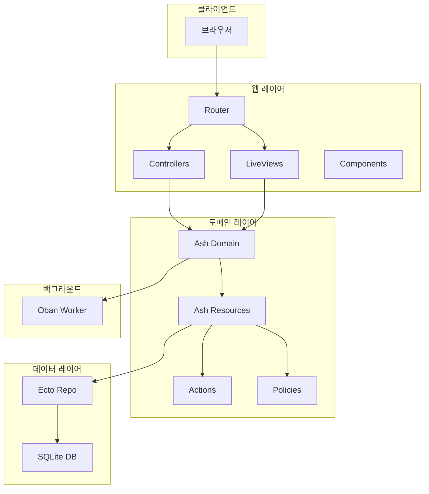
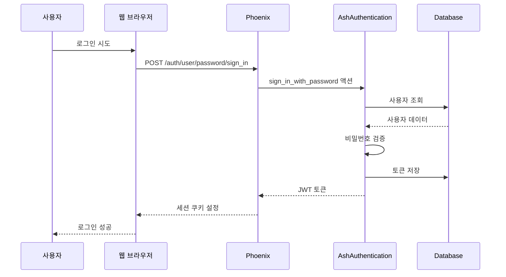

# About 프로젝트 문서

> Phoenix + Ash Framework 기반 웹 애플리케이션

## 📚 목차

1. [프로젝트 개요](#프로젝트-개요)
2. [아키텍처](#아키텍처)
3. [핵심 모듈](#핵심-모듈)
4. [인증 시스템](#인증-시스템)
5. [데이터베이스](#데이터베이스)
6. [API 및 라우팅](#api-및-라우팅)
7. [백그라운드 작업](#백그라운드-작업)
8. [프론트엔드](#프론트엔드)
9. [개발 가이드](#개발-가이드)
10. [테스트](#테스트)
11. [배포](#배포)

---

## 프로젝트 개요

### 기술 스택
| 레이어 | 기술 | 버전 | 용도 |
|--------|------|------|------|
| 언어 | Elixir | ~> 1.15 | 메인 프로그래밍 언어 |
| 웹 프레임워크 | Phoenix | ~> 1.8.1 | HTTP 서버, 라우팅, LiveView |
| 도메인 프레임워크 | Ash | ~> 3.0 | 리소스 관리, 비즈니스 로직 |
| 인증 | AshAuthentication | ~> 4.0 | 사용자 인증 및 인가 |
| 데이터베이스 | SQLite3 | - | 데이터 저장소 |
| 백그라운드 작업 | Oban | ~> 2.0 | 비동기 작업 처리 |
| CSS 프레임워크 | Tailwind CSS | 4.1.7 | 스타일링 |
| JS 번들러 | ESBuild | 0.25.4 | JavaScript 빌드 |

### 프로젝트 구조
```
about/
├── lib/
│   ├── about/                    # 비즈니스 로직
│   │   ├── accounts/             # 인증 도메인
│   │   │   ├── user.ex          # 사용자 리소스
│   │   │   └── token.ex         # 토큰 리소스
│   │   ├── accounts.ex          # Ash 도메인 정의
│   │   ├── application.ex       # OTP 애플리케이션
│   │   ├── repo.ex              # Ecto 저장소
│   │   └── secrets.ex           # 암호화 설정
│   │
│   └── about_web/                # 웹 레이어
│       ├── components/           # UI 컴포넌트
│       ├── controllers/          # HTTP 컨트롤러
│       ├── router.ex            # 라우팅 정의
│       ├── endpoint.ex          # Phoenix 엔드포인트
│       └── live_user_auth.ex    # LiveView 인증
│
├── priv/
│   ├── repo/
│   │   └── migrations/          # 데이터베이스 마이그레이션
│   └── static/                  # 정적 자산
│
├── assets/                      # 프론트엔드 소스
│   ├── js/                     # JavaScript
│   └── css/                    # CSS
│
├── test/                       # 테스트 파일
├── config/                     # 설정 파일
└── mix.exs                     # 프로젝트 정의
```

---

## 아키텍처

### 레이어드 아키텍처



### OTP 슈퍼비전 트리

```elixir
About.Application
├── AboutWeb.Telemetry
├── About.Repo
├── Ecto.Migrator
├── Oban
├── DNSCluster
├── Phoenix.PubSub
├── AboutWeb.Endpoint
└── AshAuthentication.Supervisor
```

---

## 핵심 모듈

### About.Accounts (Ash Domain)

**파일**: `lib/about/accounts.ex`

```elixir
defmodule About.Accounts do
  use Ash.Domain, extensions: [AshAdmin.Domain]
  
  resources do
    resource About.Accounts.Token
    resource About.Accounts.User
  end
end
```

**역할**:
- 사용자 관리 도메인 경계 정의
- 리소스 등록 및 관리
- Admin 인터페이스 제공

### About.Accounts.User (Ash Resource)

**파일**: `lib/about/accounts/user.ex`

**속성**:
| 필드 | 타입 | 설명 |
|------|------|------|
| id | uuid | 기본 키 |
| email | ci_string | 이메일 (대소문자 구분 없음) |
| hashed_password | string | 암호화된 비밀번호 |
| confirmed_at | utc_datetime | 이메일 확인 시각 |

**액션**:
- `register_with_password` - 사용자 등록
- `sign_in_with_password` - 로그인
- `request_password_reset` - 비밀번호 재설정 요청
- `password_reset` - 비밀번호 재설정 실행
- `confirm_new_user` - 이메일 확인

### About.Accounts.Token (Ash Resource)

**파일**: `lib/about/accounts/token.ex`

**속성**:
| 필드 | 타입 | 설명 |
|------|------|------|
| jti | string | JWT ID (기본 키) |
| subject | string | 토큰 주체 |
| expires_at | utc_datetime | 만료 시각 |
| purpose | string | 토큰 용도 |
| extra_data | map | 추가 데이터 |

**액션**:
- `store_token` - 토큰 저장
- `revoke_token` - 토큰 폐기
- `revoke_all_tokens` - 모든 토큰 폐기

---

## 인증 시스템

### 인증 플로우



### 인증 전략

1. **비밀번호 인증**
   - BCrypt 해싱
   - 이메일 + 비밀번호
   - 비밀번호 재설정 지원

2. **Magic Link 인증**
   - 이메일로 일회용 링크 전송
   - 비밀번호 없는 로그인

3. **이메일 확인**
   - 등록 후 확인 이메일
   - 확인 전까지 제한된 접근

### LiveView 인증 Hooks

```elixir
# lib/about_web/live_user_auth.ex

on_mount {AboutWeb.LiveUserAuth, :live_user_required}
# 인증된 사용자 필수

on_mount {AboutWeb.LiveUserAuth, :live_user_optional}  
# 인증된 사용자 선택적

on_mount {AboutWeb.LiveUserAuth, :live_no_user}
# 비인증 사용자만 허용
```

---

## 데이터베이스

### 스키마 구조

#### users 테이블
```sql
CREATE TABLE users (
  id UUID PRIMARY KEY DEFAULT gen_random_uuid(),
  email CITEXT NOT NULL UNIQUE,
  hashed_password TEXT NOT NULL,
  confirmed_at TIMESTAMP,
  inserted_at TIMESTAMP NOT NULL DEFAULT NOW(),
  updated_at TIMESTAMP NOT NULL DEFAULT NOW()
);
```

#### tokens 테이블
```sql
CREATE TABLE tokens (
  jti TEXT PRIMARY KEY,
  subject TEXT NOT NULL,
  expires_at TIMESTAMP NOT NULL,
  purpose TEXT NOT NULL,
  extra_data JSONB,
  inserted_at TIMESTAMP NOT NULL DEFAULT NOW(),
  updated_at TIMESTAMP NOT NULL DEFAULT NOW()
);
```

### 마이그레이션

Ash Framework가 리소스 정의에서 자동으로 마이그레이션 생성:

```bash
# 마이그레이션 생성
mix ash.generate_migrations

# 마이그레이션 실행
mix ash.migrate

# 롤백
mix ash.rollback
```

---

## API 및 라우팅

### 라우터 구조

**파일**: `lib/about_web/router.ex`

```elixir
defmodule AboutWeb.Router do
  use AboutWeb, :router
  use AshAuthentication.Phoenix.Router
  
  pipeline :browser do
    plug :accepts, ["html"]
    plug :fetch_session
    plug :fetch_live_flash
    plug :protect_from_forgery
    plug :load_from_session
  end
  
  pipeline :api do
    plug :accepts, ["json"]
    plug :load_from_bearer
    plug :set_actor, :user
  end
  
  scope "/" do
    pipe_through :browser
    
    # 인증 라우트
    auth_routes AuthController, About.Accounts.User
    sign_out_route AuthController
    sign_in_route(...)
    reset_route(...)
    confirm_route(...)
    magic_sign_in_route(...)
    
    # 애플리케이션 라우트
    get "/", PageController, :home
    
    # LiveView 라우트
    ash_authentication_live_session :authenticated_routes do
      # 인증된 사용자 전용 라우트
    end
  end
  
  # API 라우트
  scope "/api" do
    pipe_through :api
    # API 엔드포인트
  end
  
  # 개발 도구 (개발 환경만)
  if Application.compile_env(:about, :dev_routes) do
    scope "/dev" do
      live_dashboard "/dashboard"
      forward "/mailbox", Plug.Swoosh.MailboxPreview
    end
    
    scope "/admin" do
      ash_admin "/"
    end
    
    scope "/" do
      oban_dashboard("/oban")
    end
  end
end
```

### 주요 엔드포인트

| 경로 | 메서드 | 설명 |
|------|--------|------|
| `/` | GET | 홈페이지 |
| `/auth/user/password/register` | POST | 사용자 등록 |
| `/auth/user/password/sign_in` | POST | 로그인 |
| `/auth/user/password/reset_request` | POST | 비밀번호 재설정 요청 |
| `/auth/sign_out` | DELETE | 로그아웃 |
| `/dev/dashboard` | GET | Phoenix LiveDashboard |
| `/admin` | GET | Ash Admin 인터페이스 |
| `/oban` | GET | Oban 대시보드 |

---

## 백그라운드 작업

### Oban 설정

**파일**: `config/config.exs`

```elixir
config :about, Oban,
  engine: Oban.Engines.Lite,
  notifier: Oban.Notifiers.PG,
  queues: [default: 10],
  repo: About.Repo,
  plugins: [{Oban.Plugins.Cron, []}]
```

### AshOban 통합

Ash 액션을 Oban 작업으로 실행:

```elixir
# 예시: 비동기 이메일 전송
defmodule About.Accounts.User.Senders.SendPasswordResetEmail do
  use AshOban.Worker
  
  @impl true
  def perform(%Oban.Job{args: %{"user_id" => user_id}}) do
    # 이메일 전송 로직
  end
end
```

### 작업 큐

| 큐 | 동시성 | 용도 |
|----|--------|------|
| default | 10 | 일반 백그라운드 작업 |

---

## 프론트엔드

### 기술 스택

- **Tailwind CSS 4.1.7** - 유틸리티 기반 CSS
- **daisyUI** - UI 컴포넌트 라이브러리
- **Phoenix LiveView** - 실시간 인터렉션
- **Alpine.js** - 가벼운 JavaScript 프레임워크

### 테마 시스템

**파일**: `vendor/daisyui-theme.js`

```javascript
// 다크/라이트 테마 지원
export default {
  themes: {
    dark: {
      "color-scheme": "dark",
      "primary": "#4c1d95",
      "secondary": "#f000b8",
      // Elixir 보라색 기반 색상
    },
    light: {
      "color-scheme": "light",
      "primary": "#570df8",
      "secondary": "#f000b8",
    }
  }
}
```

### LiveView 컴포넌트

**파일**: `lib/about_web/components/core_components.ex`

주요 컴포넌트:
- `<.button>` - 버튼
- `<.input>` - 폼 입력 필드
- `<.icon>` - 아이콘
- `<.modal>` - 모달 다이얼로그
- `<.flash>` - 플래시 메시지
- `<.error>` - 에러 메시지

---

## 개발 가이드

### 환경 설정

```bash
# 의존성 설치 및 설정
mix setup

# 개발 서버 시작
mix phx.server
# 또는 IEx 셸과 함께
iex -S mix phx.server
```

### 개발 워크플로우

1. **기능 개발**
   ```bash
   # 새 Ash 리소스 생성
   mix ash.gen.resource Account Transaction
   
   # 마이그레이션 생성
   mix ash.generate_migrations
   
   # 마이그레이션 실행
   mix ash.migrate
   ```

2. **코드 품질**
   ```bash
   # 포맷팅
   mix format
   
   # 컴파일 경고 체크
   mix compile --warnings-as-errors
   
   # 사용하지 않는 의존성 제거
   mix deps.unlock --unused
   
   # 전체 품질 체크 (커밋 전)
   mix precommit
   ```

3. **테스트**
   ```bash
   # 전체 테스트
   mix test
   
   # 특정 파일 테스트
   mix test test/about_web/controllers/page_controller_test.exs
   
   # 실패한 테스트만 재실행
   mix test --failed
   ```

### 디버깅

```elixir
# IEx에서 디버깅
require IEx
IEx.pry()

# LiveView 디버깅
{:ok, _} = LiveDebugger.start_link()

# Ash 액션 디버깅
Ash.Query.new(About.Accounts.User)
|> Ash.Query.filter(email == "test@example.com")
|> About.Accounts.read!()
```

---

## 테스트

### 테스트 구조

```
test/
├── about_web/
│   ├── controllers/     # 컨트롤러 테스트
│   └── live/            # LiveView 테스트
├── about/
│   └── accounts/        # 도메인 로직 테스트
└── support/
    ├── conn_case.ex     # 웹 테스트 헬퍼
    └── data_case.ex     # 데이터 테스트 헬퍼
```

### 테스트 작성

```elixir
# LiveView 테스트 예시
defmodule AboutWeb.UserLiveTest do
  use AboutWeb.ConnCase
  import Phoenix.LiveViewTest
  
  test "renders user page", %{conn: conn} do
    {:ok, view, html} = live(conn, "/users")
    assert html =~ "Users"
    assert has_element?(view, "#users-list")
  end
end

# Ash 리소스 테스트 예시
defmodule About.AccountsTest do
  use About.DataCase
  
  test "creates user with valid data" do
    assert {:ok, user} = 
      About.Accounts.User
      |> Ash.Changeset.for_create(:register_with_password, %{
        email: "test@example.com",
        password: "password123"
      })
      |> About.Accounts.create()
      
    assert user.email == "test@example.com"
  end
end
```

---

## 배포

### 프로덕션 빌드

```bash
# 의존성 가져오기
mix deps.get --only prod

# 컴파일
MIX_ENV=prod mix compile

# 자산 빌드
MIX_ENV=prod mix assets.deploy

# 릴리즈 생성
MIX_ENV=prod mix release
```

### 환경 변수

**필수 설정**:
```bash
DATABASE_URL=sqlite3://path/to/prod.db
SECRET_KEY_BASE=...
PHX_HOST=example.com
PHX_SERVER=true
```

### Docker 배포

```dockerfile
FROM elixir:1.15-alpine AS build

# 빌드 의존성
RUN apk add --no-cache build-base npm git

WORKDIR /app

# 의존성 설치
COPY mix.exs mix.lock ./
RUN mix deps.get --only prod

# 코드 복사 및 컴파일
COPY . .
RUN MIX_ENV=prod mix compile

# 자산 빌드
RUN MIX_ENV=prod mix assets.deploy

# 릴리즈 생성
RUN MIX_ENV=prod mix release

# 런타임 이미지
FROM alpine:3.18
RUN apk add --no-cache libstdc++ openssl ncurses-libs

WORKDIR /app
COPY --from=build /app/_build/prod/rel/about ./

CMD ["bin/about", "start"]
```

---

## 참고 자료

### 공식 문서
- [Phoenix Framework](https://hexdocs.pm/phoenix)
- [Ash Framework](https://ash-hq.org)
- [AshAuthentication](https://hexdocs.pm/ash_authentication)
- [Oban](https://hexdocs.pm/oban)
- [LiveView](https://hexdocs.pm/phoenix_live_view)

### 프로젝트 관련 파일
- [CLAUDE.md](./CLAUDE.md) - AI 개발 가이드
- [AGENTS.md](./AGENTS.md) - Phoenix 개발 가이드라인
- [README.md](./README.md) - 프로젝트 소개

---

*이 문서는 프로젝트의 현재 상태를 반영합니다. 업데이트가 필요한 경우 수정해 주세요.*